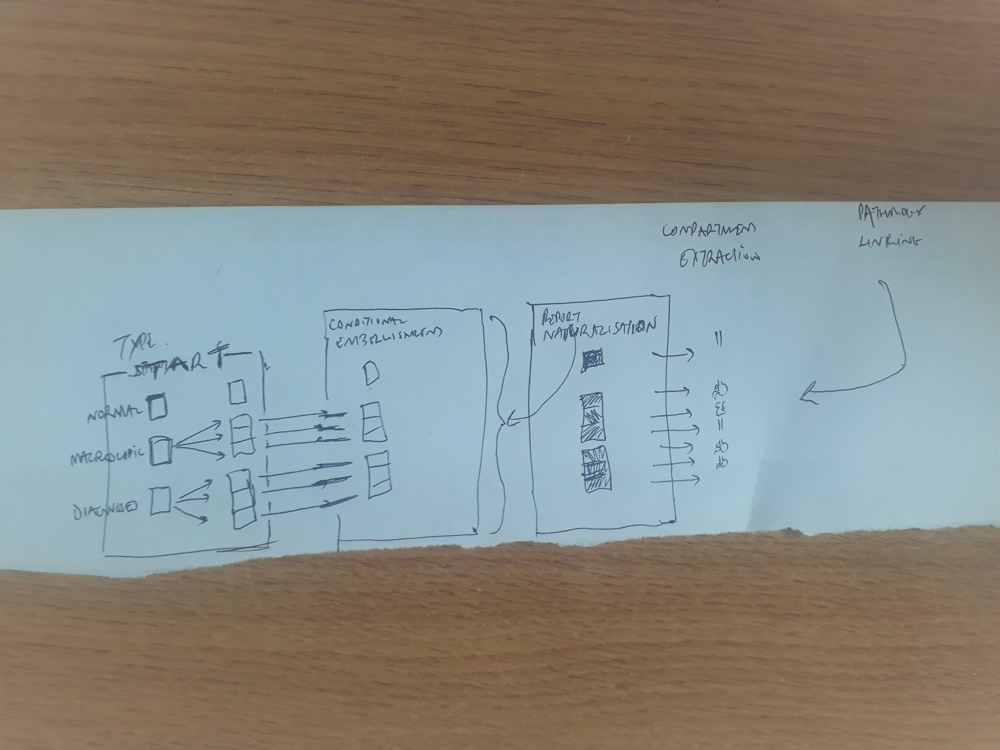
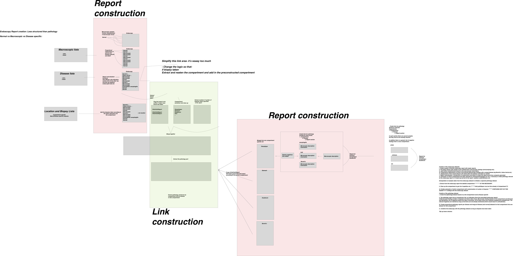

# FakeEndoReports

# 

In order to maximise the benefits of having large electronic datasets it is crucial that the datasets can be manipulated and experimented with freely. This of course is difficult where real medical data is concerned because of problems of confidentiality. Anonymising real data is not always satisfactory especially with rare conditions when patients can still be identified. 

Consequently there is a need to curate synthetic data sets based on the format of real ones. This allows on-the-fly creation of medical records without any concerns of confidentiality and therefore allows the open sourcing of data so that creative and experimental solutions can be derived for data science problems before the methodology is applied to real world solutions.

The idea of this project is to create synthesised Endoscopic reports, starting with gastroscopies, so that data scientists can utilise gastroenterology data to develop better visualisations of gastroenterology data

The endoscopy datasets are created from building blocks but internally checked so that the complete report makes sense. Furthermore, patients with individual conditions that, for example require ongoing surveillance, will have further endoscopies in the dataset for that condition which is truer to real life

As in real-life, some of the endoscopies will also have pathology reports where specimens are taken. The pathology reports are also synthetic and created in a format that means that the report as a whole makes sense.

The methodology for the building of these synthetic datasets will be further explained when the documentation is fully developed.

To install you will need to install the developing package. with 

**devtools::install_github("sebastiz/FakeEndoReports")**

You can then run the script FakeDataGenerator.R which is well documented and describes all the steps to create the Endoscopic and Pathological data sets

##Dataset creation

**1. Creation of the endoscopy datasets-	Starting point**

Endoscopy reports come as three broad groups- they are either normal, or specify macroscopic abnormalities without specifically giving a diagnosis, or they are able to give a diagnosis based on findings eg Barrett’s or an adenomatous polyp. This is therefore the starting point for the development of the dataset. 

  + i. Create sample of Normal endoscopy report with empty reports.
  + ii. Some of the empty reports are then populated with a random macroscopic finding from a selection of macroscopic findings stored as a list (stricture/polyp etc).
  + iii. The remaining reports are populated with diagnostic endoscopies eg Barrett’s descriptions etc.

**2. Conditional Embellishment**  
	Based on the report type (Normal/Macroscopic finding/Diagnostic finding), further embellishment occurs.
  + i.	If Normal then there is obviously no need for further embellishment.
  + ii.	If the report has macroscopic findings then a further list (pre-populated) is examined based on the specific macroscopic finding (eg if an ulcer is specified then a selection from the ulcer list is inserted)
  + iii.	If the report has Diagnostic findings then a selection from the specific diagnostic list is specified.

  

**3 Report naturalisation- introduction of conjunctions and others to make the report sound less computer generated**

**4.Compartment extraction**

The aspect of the endoscopic report most likely to be relevant for linking to other data sets is information about tissue retrieval e.g. biopsies/ resections etc. This is because endoscopic datasets most often link to pathology datasets. To facilitate such linkage then the dataset has to extract the compartment the biopsy was taken from (e.g. stomach/ oesophagus etc.) and the number of biopsies taken.

  + i.   Extraction of which compartment has been reported on (stomach/oesophagus/ D1 etc.)- necessary to make pathology relevant to the endoscopy report.
  + ii.  Further extraction of which compartment with randomisation of number of biopsies. 
  + iii. Create top and tail to the report- sedation used/indication etc.
  
  The back of the envelope summary can be seen here:
  

	

**5. Creation of the pathology dataset.**

  + i. Create the dpathology dataset based on a) the Compartment and b) Disease specific
  + ii. The pathology report has an introductory line, an Indication (from the associated endoscopy report), A Macroscopic finding (number of biopsies and where taken from), Microscopic finding (based on the compartment and disease) and add generic list of negatives before the report conclusion. All of these come from randomly sampled pre-compiled lists. The relevant negatives are inserted as long as the terms are not already mentioned (which would result in contradiction).
  + iii. Create proportional pathology reports per disease and merge all disease (and normal) datasets for that compartment into one dataset for that compartment.
	iv. 

**6. Combine the endoscopy with the pathology dataset as long as biopsies have been taken**

**7. Tidy up loose columns**

**Overview picture to be tidied up**

